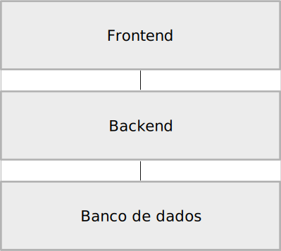

# Arquitetura

Este software é dividido em duas partes com estruturas distintas:

* **backend**: um software django com djangorestframework que fornece o backend e o acesso ao banco de dados por meio de uma API REST HTTP
* **frontend**: um software angular que fornece a interface gráfica de usuário e interage com o backend para enviar e receber informações

A figura a seguir ajuda a ilustrar estes elementos e as interações entre eles.

A figura demonstra que há uma comunicação entre frontend-backend, sendo o backend um elemento que intermedia a comunicação entre o frontend e o banco de dados, já que a tecnologia utilizada no momento não possui recursos para este fim. 

O frontend e o backend são descritos detalhadamente em cada projeto específico. O banco de dados não é descrito porque é resultado do processo de criação automática do banco de dados através do *model*, processo também conhecido como *migration*, realizado pelo django na sua função de ORM (mapeador objeto-relacional).
