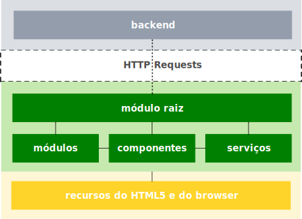

# Arquitetura do frontend

Por ser um software desenvolvido sobre o framework Angular o frontend é estruturado em elementos da arquitetura deste framework. A figura a seguir demonstra os elementos, as interações entre eles e o backend:

A interação com o backend se dá por meio de requisições HTTP. No topo da arquitetura do frontend está o módulo raiz `AppModule`. Há também outros módulos como o módulo de rotas `AppRoutingModule`, que é importado no `AppModule`, bem como módulos do Angular como `FormsModule` e `HttpClientModule`.

Há também os componentes, que fornecem a interface gráfica:

* `AppComponent`: o component raiz, que funciona como *shell*
* [`LoginComponent`](login.md): apresenta a tela de login
* `SobreComponent`: apresenta a tela sobre
* `PerfilComponent`: apresenta a tela perfil
* `PaginaNaoEncontradaComponent`: apresenta a tela de página não encontrada

Outro elemento importante desta arquitetura são os serviços, que contêm a lógica de negócio, são utilizados pelos componentes por meio do processo de **Injeção de Dependência** e, na prática, interagem diretamente com o backend por meio do serviço `HttpClient` disponível no módulo `HttpClientModule`:

* `AuthService`: responsável pela lógica de autenticação e gerenciamento da sessão do usuário enquanto utiliza o aplicativo
* `UserService`: responsável pelas funcionalidades de gerenciamento de usuários
* `PerfilService`: responsável pelas funcionalidades de obtenção do perfil do usuário da requisição (usuário logado) e gerenciamento das informações de perfis de usuários

Estes elementos são descritos nas suas respectivas páginas da documentação.
