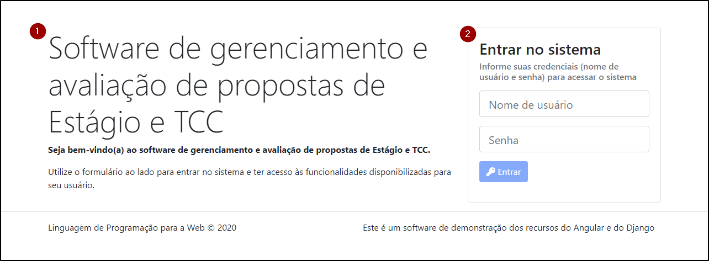

# Login

O componente login (`LoginComponent`) é responsável pela funcionalidade da tela de login (autenticação), cujo visual é ilustrado pela figura a seguir.

A figura apresenta: (1) uma identificação do sistema do lado esquerdo e, do lado direito, (2) um formulário para autenticação, que permite que o usuário informe dois campos: nome de usuário e senha. Quando os campos estão preenchidos o botão "Entrar" fica habilitado e pode ser tocado. Caso contrário, o botão permanece desabilitado.

Quando a tela é apresentada (o componente é iniciado) ele verifica se há uma sessão ativa do usuário (utilizando o método `AuthService.user()`). Se houver uma sessão ativa, então apresenta a tela **Perfil**.

Quando o usuário toca o botão "Entrar" o componente utiliza o método `AuthService.login()` e passa as informações preenchidas pelo usuário como parâmetros. Se as credenciais estiverem corretas, o software armazena informações no `LocalStorage` para representar que o usuário iniciou uma sessão no software e apresenta a tela **Perfil**. Caso contrário, apresenta a informação de que as credenciais estão incorretas.
