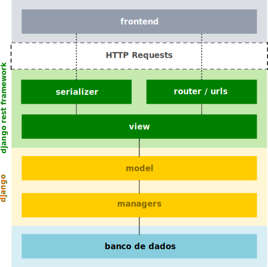

# Arquitetura

A figura a seguir apresenta os elementos da arquitetura do backend, como interagem entre si e com o frontend.

Os três principais elementos do modelo são:

* djangorestframework
* django
* banco de dados

O modelo do djangorestframework requer a definição de elementos na camada de **serializer**. Estes elementos fazem a codificação de formatos entre objeto python (geralmente um model do django) e uma representação que se adequa à solicitação do frontend (geralmente JSON). A ordem dessa codificação é nos dois sentidos, ou seja, quando o frontend envia JSON, o serializador converte para objeto python e vice-versa.

Na sequência, outro elemento é a camada de **view**, que, especificamente, realiza a interação entre a requisição que chega para o backend (intepretada por meio de rotas e URLs), serializer e os elementos do django (models e managers).

Na prática, o frontend realiza requisições HTTP para o backend, as quais passam por um processo de identificação de qual view atende a requisição, com base no endereço, e, a partir daí, continua o fluxo de atendimento da resposta com sucesso ou erro (sempre dando retorno para o frontend).

Em termos da estrutura do projeto django, os elementos da arquitetura estão presentes nos arquivos descritos a seguir:

* `backend/models.py`: declara os models (ex.: `Perfil`)
* `backend/serializers.py`: declara os serializers (ex.: `PerfilSerializer`)
* `backend/views.py`: declara as views (ex.: `PerfilLogadoViewSet`)
* `lpweb20201_estiagio_tcc_back/settings.py`: contém as configurações do projeto django e djangorestframework, como definições de segurança, permissões-padrão para acesso às views, configuração do CORS e da autorização das requisições utilizando *JSON Web Tokens*
* `lpweb20201_estiagio_tcc_back/urls.py`: contém das definições de URLs do backend (como as definições dos endpoints da API)